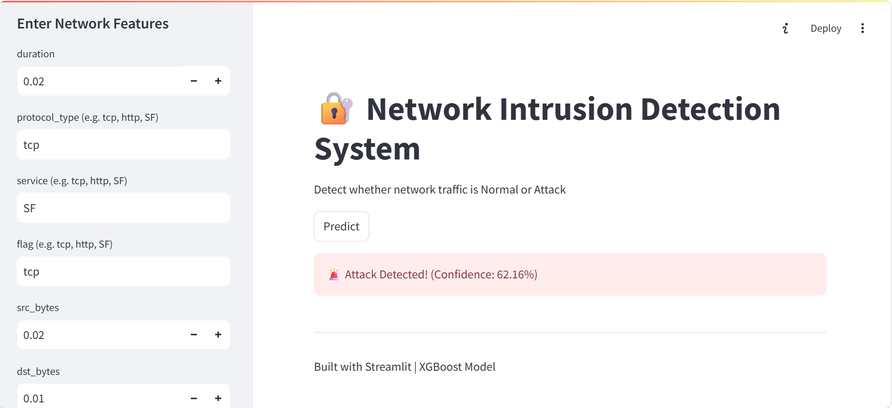

# 🚀 Network Intrusion Detection System (NIDS)

A Machine Learning-based **Network Intrusion Detection System** that detects malicious network activities and classifies them as normal or attack using advanced ML models.

---

## 📌 Project Overview

This project analyzes network traffic data and predicts whether a connection is **normal or an intrusion (attack)** using Machine Learning.

It includes:
- Data preprocessing & feature engineering
- Encoding categorical variables
- Model training (XGBoost)
- Deployment using Streamlit

---

## 🧠 Features

✅ Detects network intrusions  
✅ Real-time prediction using ML model  
✅ Uses saved encoders for preprocessing  
✅ Interactive UI with Streamlit  
✅ Ready for deployment  

---

## 📂 Project Structure

```
├── app.py
├── model.pkl
├── encoders.pkl
├── columns.pkl
├── KDDTrain+.txt
├── Network_Intrusion_detection_System.ipynb
├── requirements.txt
└── README.md
```

---

## ⚙️ Installation & Setup

### 1️⃣ Clone Repository

```bash
git clone https://github.com/SanjuVerma123/Network-Intrusion-Detection-System-App.git
cd Network-Intrusion-Detection-System-App
```

### 2️⃣ Install Dependencies

```bash
pip install -r requirements.txt
```

### 3️⃣ Run the App

```bash
streamlit run app.py
```

---

## 📊 Machine Learning Model

- Algorithm: **XGBoost Classifier**
- Dataset: **KDD Dataset**
- Handles complex patterns and imbalance effectively

---

## 🔮 How It Works

1. User inputs network data  
2. Data is encoded using saved encoders  
3. Features aligned using `columns.pkl`  
4. Model predicts:
   - Normal
   - Attack  

---

## 🖥️ Tech Stack

- Python
- Pandas & NumPy
- Scikit-learn
- XGBoost
- Streamlit

---

## 📸 Screenshots

### 🔹 App UI



## 🚀 Future Improvements
 
- Real-time packet capture  
- Deploy on streamlit   

---

## 👨‍💻 Author

**Sanju Verma**

- GitHub: [Github Repo Link(https://github.com/SanjuVerma123)]  
- LinkedIn: [Linkedin Profile link(https://www.linkedin.com/in/sanju123/)]

---

## ⭐ Contribute

Feel free to fork this repo and improve it!

---

## 📜 License

This project is open-source and available under the MIT License.
